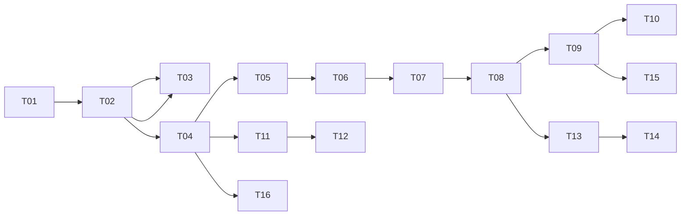

# e10d-crm — Kanban Board

Implementation tracker for v1. Tickets are **vertical slices** (tracer bullets): each delivers a thin but complete path through schema → API → UI → verification.

Source: [prd.md](./prd.md), [technical-design.md](./technical-design.md)

---

## Workflow

| Column | Meaning |
|---|---|
| **Backlog** | Defined, not ready to start (blockers incomplete) |
| **Ready** | Dependencies met; pick next |
| **In Progress** | Active (WIP limit: **1** ticket at a time) |
| **Review** | Code done; verify acceptance criteria before Done |
| **Done** | Merged / verified on homelab or local Docker |

Move tickets left → right. Only one **In Progress** slice at a time keeps integration risk low on a greenfield repo.

---

## Dependency Graph



Parallel lanes after T04: **contacts** (T05–T10, T13–T15) and **calendar** (T11–T12). Enrichment (T13–T14) and export (T15) join after dossier exists.

---

## Tickets

### T01 — App shell + password login

| Field | Value |
|---|---|
| **Status** | Ready |
| **Type** | AFK |
| **Blocked by** | — |
| **User stories** | US-1 |

**What to build:** `create-next-app` scaffold, Docker Compose (Postgres + app), Drizzle wired with empty migration runner, `/login` page, bcrypt gate, session cookie, middleware protecting all routes.

**Acceptance criteria:**
- [ ] `docker compose up` starts Postgres + app
- [ ] Unauthenticated request to `/contacts` redirects to `/login`
- [ ] Correct password sets session; wrong password fails
- [ ] Logout clears session
- [ ] `npm run lint` passes

---

### T02 — Connect a Google account

| Field | Value |
|---|---|
| **Status** | Backlog |
| **Type** | HITL (Google Cloud OAuth credentials) |
| **Blocked by** | T01 |
| **User stories** | US-2 |

**What to build:** Auth.js Google provider, `google_accounts` table, AES-256-GCM token storage, `/settings` page showing connected accounts, "Connect Google Account" OAuth flow with contacts + calendar readonly scopes.

**Acceptance criteria:**
- [ ] OAuth completes; account email shown in settings
- [ ] Tokens stored encrypted in DB
- [ ] App password session and Google OAuth are independent
- [ ] `.env.example` documents required vars

---

### T03 — Disconnect a Google account

| Field | Value |
|---|---|
| **Status** | Backlog |
| **Type** | AFK |
| **Blocked by** | T02 |
| **User stories** | US-3 |

**What to build:** Disconnect action on settings; delete `google_contact_links` + `calendar_events` for account; revoke token (best effort); remove `google_accounts` row.

**Acceptance criteria:**
- [ ] Disconnect removes account from settings UI
- [ ] Synced rows for that account deleted from DB
- [ ] Re-connect works cleanly

---

### T04 — Sync contacts from Google

| Field | Value |
|---|---|
| **Status** | Backlog |
| **Type** | AFK |
| **Blocked by** | T02 |
| **User stories** | US-4 (partial), US-5 (partial) |

**What to build:** Contact sync engine (People API), `contacts` + `google_contact_links` tables, pull on connect, minimal `/contacts` list (name + primary email).

**Acceptance criteria:**
- [ ] Connect account triggers initial contact sync
- [ ] Contacts visible on `/contacts`
- [ ] Re-sync updates by `google_resource_id` (no duplicates)
- [ ] Unit tests for sync merge logic with fixture payloads

---

### T05 — Multi-account dedup by email

| Field | Value |
|---|---|
| **Status** | Backlog |
| **Type** | AFK |
| **Blocked by** | T04 |
| **User stories** | US-4 |

**What to build:** When second Google account connects, merge contacts sharing normalized primary email into one canonical row; multiple `google_contact_links` per contact.

**Acceptance criteria:**
- [ ] Same email from two accounts → one contact row
- [ ] Different emails for same person → separate contacts (no manual merge v1)
- [ ] Dedup unit tests pass

---

### T06 — Contact search

| Field | Value |
|---|---|
| **Status** | Backlog |
| **Type** | AFK |
| **Blocked by** | T05 |
| **User stories** | US-6 (name, email only — tags/notes in T09) |

**What to build:** Search input on `/contacts`; filter by display name (trigram) and email substring.

**Acceptance criteria:**
- [ ] Search by name returns matching contacts
- [ ] Search by email returns matching contacts
- [ ] Empty search shows full list

---

### T07 — Tags: create, assign, filter

| Field | Value |
|---|---|
| **Status** | Backlog |
| **Type** | AFK |
| **Blocked by** | T06 |
| **User stories** | US-7 |

**What to build:** `tags` + `contact_tags` tables, tag picker on contact edit, tags column on list, filter by tag on `/contacts`.

**Acceptance criteria:**
- [ ] Create freeform tag and assign to contact
- [ ] Tag visible on contact list
- [ ] Filter list by tag
- [ ] Tag assign logs `tag_added` interaction

---

### T08 — Contact dossier page

| Field | Value |
|---|---|
| **Status** | Backlog |
| **Type** | AFK |
| **Blocked by** | T07 |
| **User stories** | US-8 (partial) |

**What to build:** `/contacts/[id]` dossier: display name, emails, phones, company, title, tags, enrichment summary placeholder.

**Acceptance criteria:**
- [ ] Click contact from list opens dossier
- [ ] All synced fields + tags rendered
- [ ] 404 for unknown id

---

### T09 — Notes + interaction timeline

| Field | Value |
|---|---|
| **Status** | Backlog |
| **Type** | AFK |
| **Blocked by** | T08 |
| **User stories** | US-9, US-14 (partial), US-6 (notes search) |

**What to build:** `interactions` table, add note form on dossier, reverse-chronological timeline (notes, tag changes), update `last_interaction_at`, extend search to note content.

**Acceptance criteria:**
- [ ] Add timestamped note on dossier
- [ ] Timeline shows notes + tag_added/tag_removed
- [ ] Search finds contacts by note content
- [ ] `last_interaction_at` updates on note

---

### T10 — Edit contact + user_overrides

| Field | Value |
|---|---|
| **Status** | Backlog |
| **Type** | AFK |
| **Blocked by** | T09 |
| **User stories** | US-8 (edit path) |

**What to build:** `/contacts/[id]/edit`, `user_overrides` jsonb, edit sets override flags, re-sync skips overridden fields.

**Acceptance criteria:**
- [ ] User can edit display name, company, title, etc.
- [ ] Edited fields survive Google re-sync
- [ ] Non-overridden fields still update from sync
- [ ] Unit tests for override merge logic

---

### T11 — Calendar sync + events list

| Field | Value |
|---|---|
| **Status** | Backlog |
| **Type** | AFK |
| **Blocked by** | T04 |
| **User stories** | US-12 |

**What to build:** Calendar sync engine (30d past / 90d future), `calendar_events` table, `/calendar` page listing upcoming events.

**Acceptance criteria:**
- [ ] Events sync on account connect + manual/cron trigger
- [ ] `/calendar` shows events sorted by start time
- [ ] Upsert by `(google_account_id, google_event_id)`

---

### T12 — Link calendar events to contacts

| Field | Value |
|---|---|
| **Status** | Backlog |
| **Type** | AFK |
| **Blocked by** | T11, T08 |
| **User stories** | US-13, US-8 (calendar on dossier) |

**What to build:** Match attendee emails to contacts; `linked_contact_id` on events; show upcoming linked events on dossier; link from calendar row to contact.

**Acceptance criteria:**
- [ ] Event with known attendee email links to contact
- [ ] Dossier shows upcoming meetings with this contact
- [ ] Calendar row links to contact dossier when linked

---

### T13 — Enrichment pipeline + LeadPure (single)

| Field | Value |
|---|---|
| **Status** | Backlog |
| **Type** | AFK |
| **Blocked by** | T08 |
| **User stories** | US-10, US-11 (partial) |

**What to build:** Enricher plugin interface, LeadPure provider, `enrichment_runs` table, "Enrich" button on dossier, merge into `enrichment_blob` + display fields (respecting `user_overrides`).

**Acceptance criteria:**
- [ ] Trigger enrichment on one contact from dossier
- [ ] Success populates company/title/location/social where available
- [ ] `enrichment` interaction logged
- [ ] LeadPure HTTP mocked in tests

---

### T14 — Batch enrichment with exponential retry

| Field | Value |
|---|---|
| **Status** | Backlog |
| **Type** | AFK |
| **Blocked by** | T13 |
| **User stories** | US-11 |

**What to build:** Batch enrich action (settings or dossier list select), chunked processing, exponential backoff (1s → 60s, 5 retries), per-contact status in `enrichment_runs`.

**Acceptance criteria:**
- [ ] Batch of N contacts processes sequentially/in chunks
- [ ] Transient failures retry with backoff
- [ ] Failed contacts marked failed; successes not re-queued
- [ ] Retry behavior covered by unit tests

---

### T15 — JSON export

| Field | Value |
|---|---|
| **Status** | Backlog |
| **Type** | AFK |
| **Blocked by** | T09 |
| **User stories** | US-15 |

**What to build:** `GET /api/export/contacts` (session required), download button on settings, versioned JSON per technical-design §10.

**Acceptance criteria:**
- [ ] Export includes contacts, tags, notes, interactions, enrichment, userOverrides
- [ ] Requires app session
- [ ] Valid JSON; documents `version: 1`

---

### T16 — Background sync + status

| Field | Value |
|---|---|
| **Status** | Backlog |
| **Type** | AFK |
| **Blocked by** | T04, T11 |
| **User stories** | (infra — supports all sync stories) |

**What to build:** `POST /api/sync/trigger` with cron secret, in-process 6h scheduler, manual "Sync now" on settings, last sync timestamps + error surfacing.

**Acceptance criteria:**
- [ ] Cron endpoint syncs all connected accounts
- [ ] Manual sync from settings works
- [ ] Settings shows last sync time per account
- [ ] Sync errors visible without data loss

---

## Suggested sprint order

Work **Ready → Done** one ticket at a time. Critical path:

```
T01 → T02 → T04 → T05 → T06 → T07 → T08 → T09 → T10
                              ↘ T11 → T12 (after T08)
                              ↘ T13 → T14 (after T08)
T09 → T15
T04+T11 → T16
T02 → T03 (anytime after T02, before ship)
```

**Recommended pick order:** T01, T02, T04, T05, T06, T07, T08, T11, T12, T09, T10, T13, T14, T15, T16, T03.

T03 (disconnect) can slot in after T02 for early cleanup testing; defer if focusing on happy path.

---

## Board snapshot

GitHub Issues: https://github.com/enw/e10d-crm/issues

| ID | GitHub | Title | Status | Blocked by |
|---|---|---|---|---|
| T01 | [#1](https://github.com/enw/e10d-crm/issues/1) | App shell + password login | Done | — |
| T02 | [#2](https://github.com/enw/e10d-crm/issues/2) | Connect a Google account | Done | #1 |
| T03 | [#3](https://github.com/enw/e10d-crm/issues/3) | Disconnect a Google account | Ready | #2 |
| T04 | [#4](https://github.com/enw/e10d-crm/issues/4) | Sync contacts from Google | Backlog | #2 |
| T05 | [#5](https://github.com/enw/e10d-crm/issues/5) | Multi-account dedup by email | Backlog | #4 |
| T06 | [#6](https://github.com/enw/e10d-crm/issues/6) | Contact search | Backlog | #5 |
| T07 | [#7](https://github.com/enw/e10d-crm/issues/7) | Tags: create, assign, filter | Backlog | #6 |
| T08 | [#8](https://github.com/enw/e10d-crm/issues/8) | Contact dossier page | Backlog | #7 |
| T09 | [#9](https://github.com/enw/e10d-crm/issues/9) | Notes + interaction timeline | Backlog | #8 |
| T10 | [#10](https://github.com/enw/e10d-crm/issues/10) | Edit contact + user_overrides | Backlog | #9 |
| T11 | [#11](https://github.com/enw/e10d-crm/issues/11) | Calendar sync + events list | Backlog | #4 |
| T12 | [#12](https://github.com/enw/e10d-crm/issues/12) | Link calendar events to contacts | Backlog | #11, #8 |
| T13 | [#13](https://github.com/enw/e10d-crm/issues/13) | Enrichment + LeadPure (single) | Backlog | #8 |
| T14 | [#14](https://github.com/enw/e10d-crm/issues/14) | Batch enrichment with retry | Backlog | #13 |
| T15 | [#15](https://github.com/enw/e10d-crm/issues/15) | JSON export | Backlog | #9 |
| T16 | [#16](https://github.com/enw/e10d-crm/issues/16) | Background sync + status | Backlog | #4, #11 |

---

## Using Matt Pocock skills

**Yes — partially.** The relevant skill is **`to-issues`** (`~/.claude/skills/to-issues`):

| Capability | `to-issues` | This kanban doc |
|---|---|---|
| Vertical slices (not layer cake) | ✅ | ✅ |
| Dependency / blocked-by | ✅ | ✅ |
| HITL vs AFK classification | ✅ | ✅ (T02 = HITL) |
| Quiz user before publishing | ✅ | Skipped — you asked for full breakdown |
| Publish to GitHub Issues | ✅ | ✅ [#1–#16](https://github.com/enw/e10d-crm/issues) |
| Kanban column tracking | ❌ | ✅ in this file + GitHub labels |

**Workflow:** Triage on GitHub (`needs-triage` → `ready` → `in-progress` → `done`). Update this file's Status column when closing issues. Issue #1 is labeled `ready` — start there.

---

## Ticket body template (for GitHub)

When publishing, use this per ticket:

```markdown
## What to build
<from ticket above>

## Acceptance criteria
<checkboxes from ticket>

## Blocked by
#<issue> or None

## User stories
US-N, ...
```

Label suggestion: `needs-triage` on create (per `to-issues`), then `ready` / `in-progress` / `done` as work proceeds.
