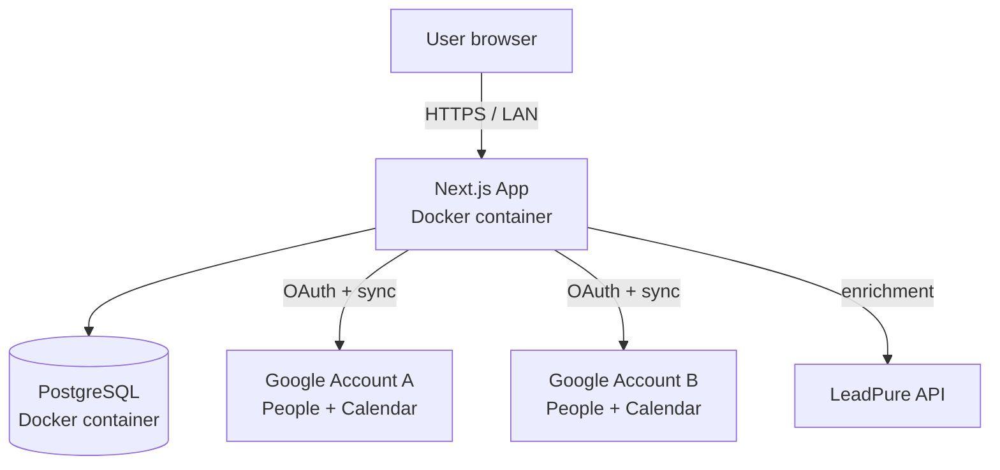
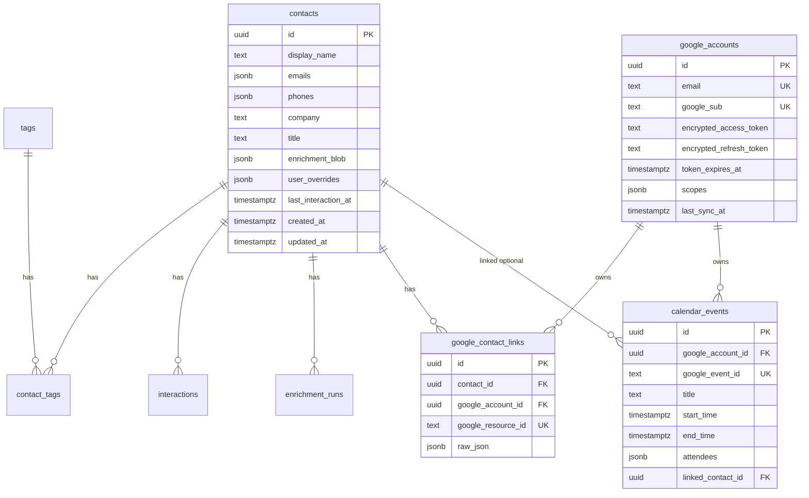
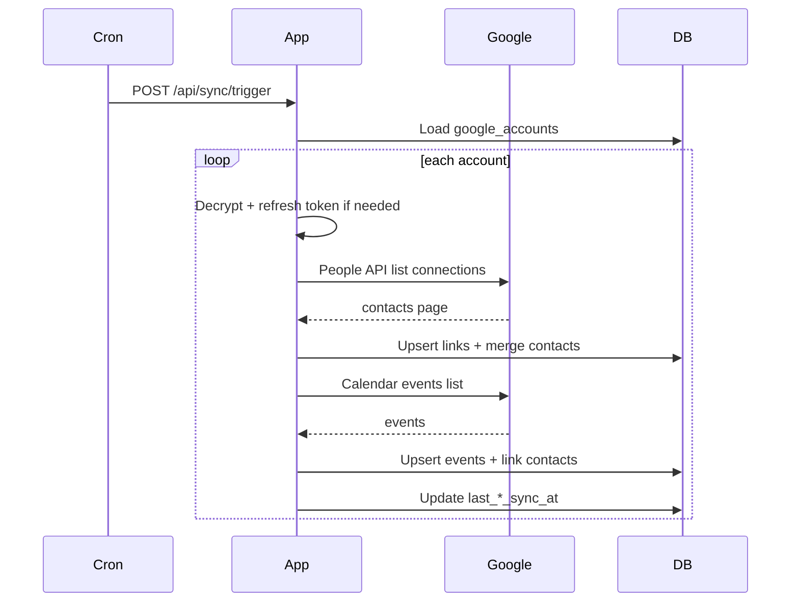

# e10d-crm — Technical Design

Companion to [prd.md](./prd.md). Defines architecture, data model, interfaces, and deployment for v1.

---

## 1. Goals & Constraints

| Goal | Constraint |
|---|---|
| Unified contact + calendar view across multiple Google accounts | Single-user, homelab-hosted |
| Dossiers with notes, tags, enrichment, interaction history | No multi-tenant, no public API |
| Modular enrichment (LeadPure first) | No AI summaries in v1 |
| Data portability | JSON export required |
| Neglected-relationship signal | Collect data only; no UI in v1 |

**Non-goals:** mobile app, email client, workflow automation, team features, cloud hosting (Vercel/K8s).

---

## 2. System Context



Homelab runs two containers: `app` (Next.js) and `db` (Postgres). User reaches app over LAN or Tailscale via plain HTTP on port 3000. No reverse proxy or TLS in v1 — acceptable for homelab-only access behind app password gate.

---

## 3. Tech Stack

| Layer | Choice | Rationale |
|---|---|---|
| Framework | Next.js 15+ App Router (`src/app/`) | PRD decision; RSC + server actions fit homelab single-process |
| Language | TypeScript | Type safety for sync/enrichment boundaries |
| Styling | Tailwind CSS | Scaffold default |
| ORM | Drizzle | PRD preference; SQL-first, good Postgres support |
| DB | PostgreSQL 16 | Neon-compatible schema; same image in Docker |
| App auth | bcrypt password in `AUTH_PASSWORD` | Simple homelab gate |
| Google OAuth | Auth.js v5 (`next-auth`) | Separate from app auth; token storage in DB |
| Google APIs | `googleapis` npm package | Official client; mock at test boundary |
| Background sync | `node-cron` in app process | No separate worker in v1; cron inside container |
| Token encryption | AES-256-GCM (`TOKEN_ENCRYPTION_KEY`) | At-rest protection for OAuth tokens |
| Testing | Vitest + Drizzle test DB | Unit + integration per PRD |
| Container | Docker Compose | Single `docker-compose up` |

---

## 4. Module Architecture

```
src/
├── app/                    # Routes, layouts, server actions
├── lib/
│   ├── auth/               # App password session + middleware
│   ├── google/             # OAuth helpers, token refresh, API clients
│   ├── sync/
│   │   ├── contacts.ts     # Contact sync engine
│   │   └── calendar.ts     # Calendar sync engine
│   ├── enrichment/
│   │   ├── pipeline.ts     # Orchestrator
│   │   ├── types.ts        # Enricher interface
│   │   └── providers/
│   │       └── leadpure.ts
│   ├── contacts/           # Dedup, merge, queries
│   ├── interactions/       # Notes + audit log
│   ├── tags/               # Tag CRUD
│   ├── export/             # JSON export
│   └── crypto/             # AES encrypt/decrypt for tokens
├── db/
│   ├── schema.ts           # Drizzle schema
│   ├── migrations/
│   └── index.ts            # Connection pool
└── middleware.ts           # App auth gate
```

### 4.1 Auth (app password)

- **Login:** POST `/api/auth/login` with password → compare bcrypt hash of `AUTH_PASSWORD` → set signed HTTP-only cookie (`crm_session`, 7-day TTL).
- **Middleware:** All routes except `/login` and static assets require valid session cookie.
- **Logout:** Clear cookie.
- **No user table:** Single operator; password is env-only.

### 4.2 Google Account Manager

Decoupled from app auth. Auth.js handles Google OAuth with a custom `Account` adapter writing to `google_accounts`.

**Connect flow:**

1. User clicks "Connect Google Account" in `/settings`.
2. Redirect to Auth.js Google provider with scopes:
   - `https://www.googleapis.com/auth/contacts.readonly`
   - `https://www.googleapis.com/auth/calendar.readonly`
3. On callback: upsert `google_accounts` row (email unique), encrypt tokens, trigger initial sync job.
4. Store Google `sub` / account id for re-link detection.

**Disconnect flow:**

1. User confirms disconnect for account id.
2. Delete `google_contact_links` and `calendar_events` for that account.
3. Re-run contact dedup (orphaned merges may split).
4. Revoke token via Google revoke endpoint (best effort).
5. Delete `google_accounts` row.

**Token refresh:** Before any Google API call, check expiry; refresh using stored refresh token; persist new access token (encrypted).

### 4.3 Contact Sync Engine

**Pull model:** On connect + periodic cron (default: every 6 hours).

```
for each google_account:
  fetch all contacts (People API connections.list + batch get)
  for each person:
    extract emails, names, phones, org
    upsert google_contact_links (google_account_id, google_resource_id, raw_json)
    merge into canonical contact (dedup by normalized primary email)
```

**Deduplication rules:**

| Field | Rule |
|---|---|
| Primary key | Lowercase trimmed email |
| Name | Prefer longest non-empty; user override wins (see `user_overrides`) |
| Phones | Union, dedupe by E.164 if possible |
| Company | Prefer enrichment > Google org > empty; user override wins |
| Google IDs | Many-to-one via `google_contact_links` |

**No manual merge in v1:** If the same person appears under different emails across Google accounts, they remain separate contacts. Manual merge is deferred to a future version.

**Re-sync:** Match existing link by `(google_account_id, google_resource_id)`. Update canonical contact fields from Google unless the field is listed in `user_overrides` (user-edited fields are never overwritten by sync). Notes, tags, and enrichment are always preserved.

### 4.4 Calendar Sync Engine

- Pull events in window: `[now - 30 days, now + 90 days]` per connected account (v1 default; window made configurable in a future version).
- Upsert by `(google_account_id, google_event_id)`.
- **Contact linking:** Match attendee emails (excluding account owner emails) to `contacts.emails` JSON array; set `linked_contact_id` when exactly one match; null when zero or ambiguous (v1: first match if multiple contacts share email — should not happen post-dedup).

### 4.5 Enrichment Pipeline

Plugin interface:

```typescript
interface Enricher {
  id: string; // e.g. "leadpure"
  enrich(email: string): Promise<EnrichmentResult>;
}

interface EnrichmentResult {
  company?: string;
  title?: string;
  location?: string;
  linkedinUrl?: string;
  twitterUrl?: string;
  raw: Record<string, unknown>;
}
```

**Pipeline:**

1. Create `enrichment_runs` row (`status: pending`).
2. Call registered enricher(s) — v1: LeadPure only, single enricher per run.
3. On success: merge into `contacts.enrichment_blob`, update display fields if empty (respecting `user_overrides`), log interaction `type: enrichment`.
4. On failure: `status: failed`, store error message.

**Batch enrichment:** When enriching multiple contacts (manual batch or future auto-enrich on sync), process in chunks with **exponential backoff retry** on LeadPure rate limits and transient errors:

| Parameter | Default |
|---|---|
| Initial delay | 1s |
| Max delay | 60s |
| Max retries per contact | 5 |
| Backoff multiplier | 2× |

Failed contacts after max retries remain in `failed` state; user can retry individually. Successful contacts are not re-queued.

Configurable in settings: `LEADPURE_API_KEY`, enable/disable auto-enrich on new contacts (default: off).

### 4.6 Interaction Tracker

Append-only log on `interactions` table:

| type | source | content |
|---|---|---|
| `note` | user | free text |
| `meeting` | user | free text (manual meeting note) |
| `enrichment` | system | enricher id + summary |
| `tag_added` | system | tag name |
| `tag_removed` | system | tag name |
| `sync` | system | optional — contact updated from Google |

Dossier timeline = `interactions` ∪ derived calendar events (display only, not duplicated in interactions unless user adds note).

### 4.7 Tag Manager

- Tags: unique case-insensitive name.
- Assign/unassign via join table `contact_tags`.
- Tag changes emit interaction log entries.

---

## 5. Data Model

### 5.1 ER Diagram



### 5.2 Drizzle Schema (detailed)

```typescript
// contacts
id: uuid PK default gen_random_uuid()
display_name: text not null default ''
emails: jsonb not null default '[]'      // string[], first = primary
phones: jsonb not null default '[]'
company: text
title: text
location: text
enrichment_blob: jsonb                   // { leadpure: {...}, ... }
user_overrides: jsonb not null default '{}'  // field names user has edited, e.g. { "display_name": true, "company": true }
last_interaction_at: timestamptz         // denormalized for neglect query
created_at, updated_at: timestamptz

// tags
id: uuid PK
name: text unique not null               // stored lowercase

// contact_tags
contact_id, tag_id: composite PK

// interactions
id: uuid PK
contact_id: uuid FK → contacts
type: enum('note','meeting','enrichment','tag_added','tag_removed','sync')
content: text
metadata: jsonb                          // e.g. { tagId, enricherId }
occurred_at: timestamptz not null default now()

// google_accounts
id: uuid PK
email: text unique not null
google_sub: text unique not null
encrypted_access_token: text not null
encrypted_refresh_token: text
token_expires_at: timestamptz
scopes: jsonb
last_contacts_sync_at: timestamptz
last_calendar_sync_at: timestamptz

// google_contact_links
id: uuid PK
contact_id: uuid FK
google_account_id: uuid FK
google_resource_id: text not null
raw_json: jsonb
unique(google_account_id, google_resource_id)

// calendar_events
id: uuid PK
google_account_id: uuid FK
google_event_id: text not null
title: text
description: text
start_time, end_time: timestamptz
attendees: jsonb                        // [{ email, name, responseStatus }]
linked_contact_id: uuid FK nullable
unique(google_account_id, google_event_id)

// enrichment_runs
id: uuid PK
contact_id: uuid FK
source: text not null                    // 'leadpure'
status: enum('pending','success','failed')
result: jsonb
error_message: text
run_at: timestamptz default now()
```

### 5.3 Indexes

```sql
CREATE INDEX idx_contacts_emails ON contacts USING gin (emails jsonb_path_ops);
CREATE INDEX idx_contacts_last_interaction ON contacts (last_interaction_at);
CREATE INDEX idx_contacts_display_name_trgm ON contacts USING gin (display_name gin_trgm_ops);
CREATE INDEX idx_interactions_contact_occurred ON interactions (contact_id, occurred_at DESC);
CREATE INDEX idx_calendar_events_start ON calendar_events (start_time);
CREATE INDEX idx_calendar_events_linked ON calendar_events (linked_contact_id) WHERE linked_contact_id IS NOT NULL;
```

Enable `pg_trgm` extension for fuzzy name search.

### 5.4 Neglected Relationships (data-only v1)

Denormalize `contacts.last_interaction_at` — updated on:

- New note or meeting interaction
- Tag assign (optional — exclude from neglect calc)
- Manual user touch (view/edit does not count)

Query for future UI:

```sql
SELECT * FROM contacts
WHERE last_interaction_at < now() - interval '90 days'
   OR last_interaction_at IS NULL
ORDER BY last_interaction_at NULLS FIRST;
```

---

## 6. API & Server Actions

Prefer **Server Actions** for mutations; **Route Handlers** for OAuth callbacks, export download, and cron webhook.

| Endpoint / Action | Method | Purpose |
|---|---|---|
| `/login` | GET/POST | App password login page + form |
| `/api/auth/logout` | POST | Clear session |
| `/api/auth/google` | GET | Auth.js Google connect |
| `/api/auth/callback/google` | GET | OAuth callback |
| `/api/sync/trigger` | POST | Manual sync (session + optional cron secret) |
| `/api/export/contacts` | GET | JSON download |
| `searchContacts(q, tags?)` | action | Full-text search |
| `assignTag(contactId, tagId)` | action | Tag assign + log |
| `addNote(contactId, content)` | action | Note + update last_interaction_at |
| `updateContact(contactId, fields)` | action | Edit fields; set keys in `user_overrides` |
| `runEnrichment(contactId)` | action | Trigger pipeline |
| `disconnectGoogleAccount(id)` | action | Teardown + delete synced rows |

**Cron:** `POST /api/sync/trigger` with header `X-Cron-Secret: ${CRON_SECRET}` — internal scheduler or host crontab via curl.

---

## 7. UI Routes

| Route | Server data | Client interaction |
|---|---|---|
| `/login` | — | Password form |
| `/contacts` | Paginated list, search params | Search, tag filter |
| `/contacts/[id]` | Dossier aggregate | Add note, trigger enrich |
| `/contacts/[id]/edit` | Contact + tags | Edit fields, tag picker |
| `/calendar` | Events by date range | Link to contact dossier |
| `/settings` | Connected accounts, config | Connect/disconnect Google, export btn |

**Dossier aggregate query** (single round-trip where possible):

- Contact row + tags
- Last 20 interactions
- Latest enrichment_run per source
- Upcoming calendar_events where `linked_contact_id = id`

---

## 8. Security

| Asset | Protection |
|---|---|
| `AUTH_PASSWORD` | bcrypt compare; never logged |
| OAuth tokens | AES-256-GCM; key from `TOKEN_ENCRYPTION_KEY` (32 bytes base64) |
| Session cookie | `httpOnly`, `sameSite=lax`, signed (`secure` omitted in v1 — no TLS) |
| Google scopes | Readonly only — minimize blast radius |
| Cron endpoint | Shared secret header |
| Export | Requires app session |
| DB | Not exposed outside Docker network |

**Env vars (required):**

```
DATABASE_URL=
AUTH_PASSWORD=
AUTH_SECRET=              # session signing (Auth.js + app cookie)
TOKEN_ENCRYPTION_KEY=
GOOGLE_CLIENT_ID=
GOOGLE_CLIENT_SECRET=
LEADPURE_API_KEY=           # optional until enrichment used
CRON_SECRET=
NEXTAUTH_URL=               # e.g. http://crm.local:3000
```

---

## 9. Sync & Job Lifecycle



**Initial sync on connect:** Same pipeline; UI shows "Syncing…" via polling `/api/sync/status` or revalidate on completion.

**Failure handling:** Log error per account; do not delete local data. Surface last error in settings. Retry on next cron.

---

## 10. Export Format

`GET /api/export/contacts` returns:

```json
{
  "exportedAt": "2026-05-23T12:00:00.000Z",
  "version": 1,
  "contacts": [
    {
      "id": "uuid",
      "displayName": "Jane Doe",
      "emails": ["jane@example.com"],
      "phones": ["+1..."],
      "company": "Acme",
      "title": "CEO",
      "location": "NYC",
      "tags": ["speaking", "coaching lead"],
      "notes": [
        { "content": "Met at conference", "occurredAt": "..." }
      ],
      "enrichment": { "leadpure": { } },
      "userOverrides": ["displayName", "company"],
      "interactions": [ ],
      "googleAccounts": ["personal@gmail.com"],
      "createdAt": "...",
      "updatedAt": "..."
    }
  ]
}
```

Import not in v1 scope; format versioned for future import support.

---

## 11. Deployment

### 11.1 Docker Compose

```yaml
services:
  db:
    image: postgres:16-alpine
    volumes: [pgdata:/var/lib/postgresql/data]
    environment:
      POSTGRES_USER: crm
      POSTGRES_PASSWORD: ${POSTGRES_PASSWORD}
      POSTGRES_DB: crm
    healthcheck: ...

  app:
    build: .
    ports: ["3000:3000"]
    env_file: .env
    depends_on:
      db: { condition: service_healthy }
    command: sh -c "npm run db:migrate && npm run start"
```

**Dockerfile:** Multi-stage — deps, build Next.js standalone output, run as non-root.

**Host cron (optional):**

```cron
0 */6 * * * curl -sf -X POST -H "X-Cron-Secret: $CRON_SECRET" http://localhost:3000/api/sync/trigger
```

### 11.2 Migrations

- Drizzle Kit generates SQL in `src/db/migrations/`.
- Run on container start (`db:migrate` script).
- Local dev: `docker compose up db` + `npm run dev` against local Postgres.

---

## 12. Testing Strategy

| Area | Approach |
|---|---|
| Contact dedup/merge | Unit tests with fixture Google payloads |
| Sync vs user_overrides | Unit tests: sync skips overridden fields, updates others |
| Enrichment pipeline | Mock `Enricher` impl; assert blob merge + interaction log |
| Drizzle queries | Integration tests against ephemeral Postgres (testcontainers or docker) |
| Token crypto | Round-trip encrypt/decrypt tests |
| Auth middleware | Unit test cookie validation |
| Pages | Smoke render only — no snapshot suite |

**Mock boundary:** `googleapis` clients wrapped in `lib/google/client.ts`; tests inject fake responses.

**Not tested:** Live Google API, LeadPure HTTP (mock fetch).

---

## 13. Implementation Phases

| Phase | Deliverable | User stories |
|---|---|---|
| **0 — Scaffold** | Next.js, Drizzle, Docker Compose, app auth | US-1 |
| **1 — Google connect** | OAuth, token storage, settings UI | US-2, US-3 |
| **2 — Contact sync** | Sync engine, dedup, contact list + search | US-4, US-5, US-6 |
| **3 — Tags & notes** | Tag manager, dossier, interactions | US-7, US-8, US-9, US-14 |
| **4 — Calendar** | Calendar sync, event list, contact linking | US-12, US-13 |
| **5 — Enrichment** | Pipeline + LeadPure provider | US-10, US-11 |
| **6 — Export & polish** | JSON export, sync status, error surfacing | US-15 |

Neglected-relationship query lands in Phase 3 (schema + denormalized field); UI deferred.

---

## 14. Risks & Mitigations

| Risk | Mitigation |
|---|---|
| Google API quota / rate limits | Batch requests; exponential backoff; sync watermark |
| Duplicate contacts across accounts with different emails | v1: no auto-merge, no manual merge — separate contacts until future version |
| LeadPure rate limits on batch enrich | Exponential backoff retry (1s → 60s cap, 5 attempts) |
| Token expiry / revoked access | Refresh flow; surface reconnect in settings |
| LeadPure API changes | `raw` preserved in enrichment_blob; map fields defensively |
| Homelab downtime | All data local; export for backup |
| Auth.js + custom app auth confusion | Clear UI copy: "App password" vs "Connect Google" |

---

## 15. Design Decisions

| # | Question | Decision |
|---|---|---|
| 1 | Manual contact merge in v1? | **No.** Same person with different emails stays as separate contacts. Manual merge deferred. |
| 2 | LeadPure batch / rate limits? | **Exponential backoff retry** on batch runs (1s initial, 2× multiplier, 60s cap, 5 retries per contact). |
| 3 | TLS / reverse proxy? | **Not in v1.** Plain HTTP on LAN/Tailscale; add Caddy/Traefik later if exposed beyond homelab. |
| 4 | User-edited fields vs Google re-sync? | **Yes — protect user edits.** `user_overrides` jsonb tracks which fields the user edited; sync skips those fields. Edit action sets the flag; clearing a field removes it from overrides. |
| 5 | Calendar sync window? | **30 days past / 90 days future** for v1. Sufficient for meeting prep; make window configurable post-v1. |

---

## 16. References

- [PRD](./prd.md)
- [Google People API](https://developers.google.com/people)
- [Google Calendar API](https://developers.google.com/calendar)
- [Auth.js](https://authjs.dev/)
- [Drizzle ORM](https://orm.drizzle.team/)
